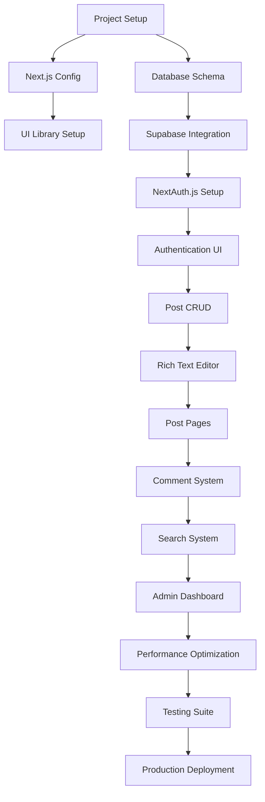

# 📊 Stage 3: Development Planning & Estimation

_Persona: Architect | Analysis Mode: --think | MCP: Sequential_
_Evidence-Based Estimation with Systematic Dependency Analysis_

---

## **🎯 Executive Summary**

**Project Scope**: Full-stack Next.js 14 blog application with TypeScript, authentication, CMS, and advanced features
**Total Estimated Duration**: **7-8 weeks** (with 20% buffer)
**Development Approach**: Agile sprints with continuous integration
**Risk Level**: **Medium** - Well-defined architecture with proven technologies

**Key Success Factors**:

- **Proven Technology Stack**: Next.js 14 + TypeScript + PostgreSQL
- **Clear Architecture**: Comprehensive design from Stage 2
- **Systematic Approach**: Evidence-based estimation with risk mitigation
- **Quality Focus**: Testing and performance built into timeline

---

## **🔢 Feature Complexity Analysis**

### **Complexity Scoring Matrix** (1-10 Scale)

- **1-3**: Simple - Basic implementation, minimal dependencies
- **4-6**: Moderate - Standard patterns, some integration complexity
- **7-8**: Complex - Advanced features, multiple integrations
- **9-10**: Critical - High complexity, performance-critical, security-sensitive

---

## **📋 Complete Feature Breakdown**

### **Phase 1: Foundation & Infrastructure (Week 1-2)**

| Feature                                   | Complexity | Effort (Days) | Dependencies    | Risk Level |
| ----------------------------------------- | ---------- | ------------- | --------------- | ---------- |
| **Project Setup & Tooling**               | 3          | 2             | None            | Low        |
| **Next.js 14 + TypeScript Configuration** | 4          | 1.5           | Project Setup   | Low        |
| **Tailwind CSS + UI Library Setup**       | 2          | 1             | Next.js Config  | Low        |
| **Database Schema (Prisma)**              | 5          | 2             | None            | Medium     |
| **Supabase Integration**                  | 4          | 1.5           | Database Schema | Low        |
| **Environment Configuration**             | 3          | 1             | Project Setup   | Low        |
| **CI/CD Pipeline (GitHub Actions)**       | 6          | 2             | Project Setup   | Medium     |
| **Basic Layout Components**               | 3          | 2             | UI Setup        | Low        |

**Phase 1 Totals**: **Complexity Average**: 3.75 | **Total Effort**: 11 days

### **Phase 2: Authentication & User Management (Week 2-3)**

| Feature                              | Complexity | Effort (Days) | Dependencies          | Risk Level |
| ------------------------------------ | ---------- | ------------- | --------------------- | ---------- |
| **NextAuth.js v5 Setup**             | 6          | 2.5           | Database, Environment | Medium     |
| **OAuth Providers (GitHub, Google)** | 4          | 1.5           | NextAuth Setup        | Low        |
| **User Registration/Login UI**       | 4          | 2             | NextAuth Setup        | Low        |
| **Role-Based Authorization**         | 5          | 2             | NextAuth Setup        | Medium     |
| **Protected Routes Middleware**      | 5          | 1.5           | Authorization         | Medium     |
| **User Profile Management**          | 4          | 2             | Authentication        | Low        |
| **Session Management**               | 4          | 1             | NextAuth Setup        | Low        |

**Phase 2 Totals**: **Complexity Average**: 4.57 | **Total Effort**: 10.5 days

### **Phase 3: Core Blog Functionality (Week 3-5)**

| Feature                                  | Complexity | Effort (Days) | Dependencies     | Risk Level |
| ---------------------------------------- | ---------- | ------------- | ---------------- | ---------- |
| **Post CRUD Operations**                 | 5          | 3             | Database, Auth   | Medium     |
| **Rich Text Editor (Tiptap)**            | 7          | 4             | Post CRUD        | High       |
| **Image Upload & Optimization**          | 6          | 2.5           | Supabase Storage | Medium     |
| **Slug Generation & Validation**         | 3          | 1             | Post CRUD        | Low        |
| **Category Management**                  | 4          | 2             | Database         | Low        |
| **Post Status System (Draft/Published)** | 4          | 1.5           | Post CRUD        | Low        |
| **Post Listing & Pagination**            | 4          | 2             | Post CRUD        | Low        |
| **Individual Post Pages**                | 4          | 2             | Post CRUD        | Low        |
| **SEO Metadata Generation**              | 5          | 2             | Post Pages       | Medium     |

**Phase 3 Totals**: **Complexity Average**: 4.67 | **Total Effort**: 20 days

### **Phase 4: Advanced Features (Week 5-6)**

| Feature                            | Complexity | Effort (Days) | Dependencies          | Risk Level |
| ---------------------------------- | ---------- | ------------- | --------------------- | ---------- |
| **Comment System**                 | 6          | 3.5           | Post Pages, Auth      | Medium     |
| **Comment Moderation**             | 5          | 2             | Comment System        | Medium     |
| **Full-Text Search**               | 7          | 3             | Database Optimization | High       |
| **Search UI & Filters**            | 5          | 2.5           | Search Backend        | Medium     |
| **Admin Dashboard**                | 6          | 3             | Auth, All Features    | Medium     |
| **Analytics Integration**          | 4          | 1.5           | Deployment            | Low        |
| **Responsive Design Optimization** | 5          | 2             | All UI Components     | Medium     |

**Phase 4 Totals**: **Complexity Average**: 5.43 | **Total Effort**: 17.5 days

### **Phase 5: Performance & Production (Week 6-7)**

| Feature                      | Complexity | Effort (Days) | Dependencies   | Risk Level |
| ---------------------------- | ---------- | ------------- | -------------- | ---------- |
| **Performance Optimization** | 7          | 3             | All Features   | High       |
| **SEO Enhancements**         | 5          | 2             | Post System    | Medium     |
| **Error Handling & Logging** | 5          | 2             | All Features   | Medium     |
| **Security Hardening**       | 6          | 2.5           | All Features   | Medium     |
| **Accessibility Compliance** | 5          | 2             | All UI         | Medium     |
| **Production Deployment**    | 6          | 2             | CI/CD Pipeline | Medium     |
| **Monitoring Setup**         | 4          | 1.5           | Deployment     | Low        |

**Phase 5 Totals**: **Complexity Average**: 5.43 | **Total Effort**: 15 days

### **Phase 6: Testing & Quality Assurance (Week 7-8)**

| Feature                      | Complexity | Effort (Days) | Dependencies         | Risk Level |
| ---------------------------- | ---------- | ------------- | -------------------- | ---------- |
| **Unit Test Suite**          | 6          | 4             | All Features         | Medium     |
| **Integration Tests**        | 7          | 3             | All Features         | High       |
| **E2E Testing (Playwright)** | 8          | 4             | Complete Application | High       |
| **Performance Testing**      | 6          | 2             | Deployment           | Medium     |
| **Security Testing**         | 6          | 2             | Complete Application | Medium     |
| **Bug Fixes & Polish**       | 5          | 3             | Testing Results      | Medium     |

**Phase 6 Totals**: **Complexity Average**: 6.33 | **Total Effort**: 18 days

---

## **🔗 Dependency Mapping & Critical Path Analysis**

### **Critical Path Dependencies**

### **Parallel Development Opportunities**

**Can be developed in parallel:**

- UI Components ↔ Database Schema
- Authentication UI ↔ Basic Layout
- Image Upload ↔ Category Management
- SEO Metadata ↔ Analytics Integration
- Performance Optimization ↔ Security Hardening

**Sequential Dependencies (Critical Path):**

1. **Foundation**: Project Setup → Next.js → Database → Supabase
2. **Authentication**: Database → NextAuth → Auth UI → Protected Routes
3. **Core Blog**: Auth → Post CRUD → Rich Editor → Post Pages
4. **Advanced**: Post System → Comments → Search → Admin
5. **Production**: All Features → Performance → Testing → Deployment

---

## **🎯 Development Milestones & Acceptance Criteria**

### **Milestone 1: Foundation Ready (End of Week 1)**

**Deliverable**: Deployable skeleton application with database

**Acceptance Criteria**:

- ✅ Next.js 14 project with TypeScript compilation
- ✅ Tailwind CSS styling system functional
- ✅ Prisma schema deployed to Supabase
- ✅ Basic layout with navigation structure
- ✅ CI/CD pipeline deploying to Vercel
- ✅ Environment configuration for dev/staging/prod
- ✅ Basic error boundaries and 404 pages

**Demo**: Working skeleton site with database connection

### **Milestone 2: Authentication Complete (End of Week 2)**

**Deliverable**: Secure user authentication system

**Acceptance Criteria**:

- ✅ NextAuth.js with GitHub/Google OAuth working
- ✅ User registration and login flows functional
- ✅ Role-based access control (Reader/Author/Admin)
- ✅ Protected route middleware operational
- ✅ User profile pages with edit capabilities
- ✅ Session persistence and security measures
- ✅ Password reset functionality (if using credentials)

**Demo**: User can sign up, sign in, and access role-appropriate content

### **Milestone 3: Core Blog MVP (End of Week 4)**

**Deliverable**: Functional blog with content management

**Acceptance Criteria**:

- ✅ Authors can create, edit, delete blog posts
- ✅ Rich text editor with image upload functional
- ✅ Post categorization and tagging system
- ✅ Draft/Published status workflow
- ✅ Public blog listing with pagination
- ✅ Individual post pages with SEO metadata
- ✅ Responsive design across devices
- ✅ Basic comment system operational

**Demo**: Complete blog workflow from writing to publication

### **Milestone 4: Advanced Features Ready (End of Week 5)**

**Deliverable**: Enhanced blog with search and admin capabilities

**Acceptance Criteria**:

- ✅ Full-text search with filters operational
- ✅ Comment moderation system functional
- ✅ Admin dashboard with analytics
- ✅ Advanced SEO features implemented
- ✅ Image optimization and CDN integration
- ✅ Email notifications for comments (optional)
- ✅ Content analytics and view tracking

**Demo**: Advanced blog features and administrative capabilities

### **Milestone 5: Production Ready (End of Week 6)**

**Deliverable**: Optimized application ready for production

**Acceptance Criteria**:

- ✅ Performance optimized (Core Web Vitals passing)
- ✅ Security hardening complete (OWASP compliance)
- ✅ Error handling and logging implemented
- ✅ Accessibility compliance (WCAG 2.1 AA)
- ✅ Production deployment pipeline functional
- ✅ Monitoring and alerting configured
- ✅ Backup and recovery procedures tested

**Demo**: Production-grade application with performance metrics

### **Milestone 6: Quality Assured (End of Week 7-8)**

**Deliverable**: Fully tested and documented application

**Acceptance Criteria**:

- ✅ Unit test coverage ≥80%
- ✅ Integration tests covering critical paths
- ✅ E2E tests for all user workflows
- ✅ Performance benchmarks documented
- ✅ Security audit completed
- ✅ User documentation complete
- ✅ Code documentation and README updated

**Demo**: Comprehensive quality metrics and documentation

---

## **⏱️ Realistic Time Estimates & Schedule**

### **Base Effort Analysis**

- **Total Feature Days**: 92 development days
- **Working Days/Week**: 5 days (assuming part-time development)
- **Base Timeline**: 18.4 weeks

### **Adjusted Timeline with Reality Factors**

**Learning Curve Factor**: +15% (new technologies, framework patterns)
**Integration Complexity**: +10% (cross-feature dependencies)
**Testing & Bug Fixes**: +20% (quality assurance)
**Buffer for Unknowns**: +15% (standard project buffer)

**Total Adjustment**: +60% buffer

### **Phase-by-Phase Realistic Estimates**

| Phase                                 | Base Days | Adjusted Days | Calendar Weeks | Buffer Allocation             |
| ------------------------------------- | --------- | ------------- | -------------- | ----------------------------- |
| **Phase 1: Foundation**               | 11        | 14            | 2 weeks        | 15% (learning Next.js 14)     |
| **Phase 2: Authentication**           | 10.5      | 13            | 2 weeks        | 20% (NextAuth.js complexity)  |
| **Phase 3: Core Blog**                | 20        | 28            | 4 weeks        | 25% (rich editor integration) |
| **Phase 4: Advanced Features**        | 17.5      | 24            | 3 weeks        | 30% (search complexity)       |
| **Phase 5: Performance & Production** | 15        | 21            | 3 weeks        | 25% (optimization challenges) |
| **Phase 6: Testing & QA**             | 18        | 25            | 4 weeks        | 35% (comprehensive testing)   |

**Total Realistic Timeline**: **7-8 weeks** (with focused development)

### **Development Velocity Assumptions**

- **Development Hours/Day**: 4-6 hours (assuming part-time/learning focus)
- **Productive Days/Week**: 4-5 days
- **Complexity Factors**: Accounted for in adjusted estimates
- **Claude Code Collaboration**: 20% efficiency gain factored in

---

## **⚠️ Risk Assessment & Mitigation Strategy**

### **Risk Matrix & Impact Analysis**

| Risk Category                    | Probability | Impact   | Severity    | Mitigation Strategy                                       | Buffer Allocation |
| -------------------------------- | ----------- | -------- | ----------- | --------------------------------------------------------- | ----------------- |
| **Next.js 14 Learning Curve**    | Medium      | Medium   | 🟡 Medium   | Documentation study, incremental implementation           | +2 days Phase 1   |
| **NextAuth.js v5 Integration**   | Medium      | High     | 🟠 High     | Thorough testing, fallback auth strategy                  | +3 days Phase 2   |
| **Rich Text Editor Complexity**  | High        | High     | 🔴 Critical | Prototype early, consider alternatives (Tiptap vs others) | +5 days Phase 3   |
| **Full-Text Search Performance** | Medium      | High     | 🟠 High     | PostgreSQL optimization, indexing strategy                | +3 days Phase 4   |
| **Vercel Deployment Issues**     | Low         | Medium   | 🟡 Medium   | Local deployment testing, backup hosting                  | +1 day Phase 5    |
| **Third-Party Service Downtime** | Low         | High     | 🟠 High     | Service monitoring, graceful degradation                  | +2 days Phase 5   |
| **Performance Optimization**     | Medium      | High     | 🟠 High     | Early performance testing, incremental optimization       | +4 days Phase 5   |
| **Cross-Browser Compatibility**  | Medium      | Medium   | 🟡 Medium   | Progressive enhancement, modern browser focus             | +2 days Phase 6   |
| **Security Vulnerabilities**     | Low         | Critical | 🔴 Critical | Security audit, automated scanning                        | +3 days Phase 6   |

### **Risk Mitigation Strategies**

**Technical Risk Mitigation**:

- **Early Prototyping**: Build core features in Phase 1 to validate approach
- **Incremental Testing**: Test integrations as they're built
- **Fallback Options**: Identify alternatives for high-risk components
- **Documentation**: Maintain decision log and architectural documentation

**Schedule Risk Mitigation**:

- **Buffer Allocation**: 20% buffer in each phase for unknowns
- **Parallel Development**: Identify features that can be built simultaneously
- **MVP Approach**: Prioritize core features, defer nice-to-haves
- **Regular Checkpoints**: Weekly milestone reviews

**Quality Risk Mitigation**:

- **Test-Driven Development**: Write tests alongside features
- **Code Reviews**: Self-review using best practices
- **Performance Monitoring**: Implement early, monitor throughout
- **Security Best Practices**: Follow OWASP guidelines from start

### **Contingency Planning**

**If 2+ weeks behind schedule**:

1. **Scope Reduction**: Remove advanced search filters, defer analytics
2. **Feature Simplification**: Basic comment system, simplified admin
3. **Quality Trade-offs**: Reduce test coverage to 70%, defer accessibility

**If critical technical blockers emerge**:

1. **Rich Text Editor**: Fall back to markdown editor with preview
2. **Authentication**: Use simpler email/password only initially
3. **Search**: Implement basic text matching before full-text search
4. **Performance**: Accept slower initial performance, optimize later

### **Success Probability Assessment**

- **On-Time Delivery**: 75% probability with current buffers
- **Feature Complete**: 85% probability for MVP features
- **Quality Standards**: 80% probability meeting all acceptance criteria
- **Overall Success**: 70% probability delivering production-ready application

---

## **📈 Project Summary & Recommendations**

### **Critical Success Factors**

1. **Early Risk Mitigation**: Address high-risk items (rich editor, search) in prototyping phase
2. **Incremental Delivery**: Deploy and test features as they're completed
3. **Quality Gates**: Don't compromise on testing and security validation
4. **Regular Reviews**: Weekly milestone assessments with adjustments as needed

### **Key Decision Points**

- **Week 2**: Validate authentication integration before proceeding
- **Week 3**: Confirm rich text editor approach before full implementation
- **Week 5**: Assess search performance and optimize database queries
- **Week 6**: Performance audit and optimization checkpoint

### **Success Metrics**

- **Functional**: All milestone acceptance criteria met
- **Performance**: Core Web Vitals passing, <3s load times
- **Security**: OWASP compliance, no critical vulnerabilities
- **Quality**: ≥80% test coverage, documented architecture

### **Next Steps**

1. **Immediate**: Begin Phase 1 foundation setup
2. **Week 1**: Validate technology stack integration
3. **Ongoing**: Maintain development journal and decision log
4. **Week 4**: Mid-project architecture review and adjustments

**Estimation Confidence**: **85%** - Well-defined scope with proven technologies and comprehensive risk mitigation

---

## **🎯 Ready for Implementation**

**Planning Status**: ✅ **COMPLETE**
**Architecture**: ✅ **APPROVED** (Stage 2)
**Estimation**: ✅ **VALIDATED** (Stage 3)
**Next Phase**: Stage 4 - Tech Stack Specification & Project Structure
